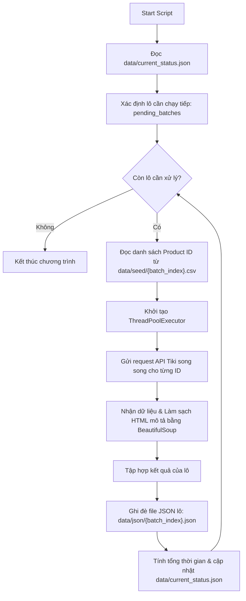

# TÀI LIỆU YÊU CẦU SẢN PHẨM (PRD)
## Dự án: Hệ Thống Cào Dữ Liệu Chi Tiết Sản Phẩm Tiki (Tiki Product Crawler)

---

## 1. Thông Tin Tài Liệu
- **Tên dự án:** Tiki Product Crawler (Project02)
- **Phiên bản:** 1.0.0
- **Ngày khởi tạo:** 02/06/2026
- **Trạng thái:** Hoàn thành thiết kế & Triển khai phiên bản đầu tiên (v1.0)
- **Tác giả:** Đội ngũ phát triển dự án restful API

---

## 2. Tổng Quan Sản Phẩm

### 2.1. Mục tiêu
Xây dựng một hệ thống cào dữ liệu (crawler) dạng CLI chạy độc lập, có hiệu năng cao, hoạt động ổn định và có khả năng phục hồi lỗi tốt. Hệ thống có nhiệm vụ truy vấn chi tiết thông tin của khoảng 200.000 sản phẩm từ API chính thức của Tiki dựa trên danh sách ID sản phẩm có sẵn, xử lý làm sạch dữ liệu và lưu trữ dưới dạng tệp JSON để phục vụ cho các bài toán phân tích thị trường hoặc phát triển API.

### 2.2. Đối tượng sử dụng
- Nhà phát triển dữ liệu (Data Engineers) cần thu thập dữ liệu sản phẩm e-commerce.
- Nhà phân tích thị trường hoặc phát triển ứng dụng cần dữ liệu kiểm thử thực tế.

### 2.3. Vấn đề cần giải quyết (Problem Statement)
1. **Khối lượng dữ liệu lớn:** Truy vấn đồng tuần tự (synchronous) cho 200.000 sản phẩm mất rất nhiều thời gian (ước tính hàng chục tiếng đồng hồ).
2. **Độ ổn định kết nối:** Quá trình cào dữ liệu dài dễ bị gián đoạn do sự cố mạng, timeout hoặc Tiki API giới hạn tần suất yêu cầu (rate limit).
3. **Mất tiến trình khi lỗi:** Nếu chương trình bị sập ở sản phẩm thứ 150.000, việc phải cào lại từ đầu gây lãng phí tài nguyên mạng, IP dễ bị chặn và mất thời gian.
4. **Dữ liệu thô chứa nhiều mã HTML:** Mô tả sản phẩm trả về từ API Tiki chứa nhiều mã HTML thô, cần được chuẩn hóa trước khi lưu trữ.

---

## 3. Các Tính Năng & Yêu Cầu Chi Tiết (Product Features)

### 3.1. Tính năng 1: Cào Dữ Liệu Song Song Đa Luồng (Multi-threaded Crawler)
- **Mô tả:** Hệ thống sử dụng lập trình đa luồng (multi-threading) để gửi đồng thời nhiều yêu cầu HTTP đến API chi tiết sản phẩm của Tiki.
- **Yêu cầu kỹ thuật:**
  - Sử dụng thư viện `ThreadPoolExecutor` để phân phối công việc cho tối đa `MAX_WORKERS` luồng.
  - Tham số số lượng luồng (`MAX_WORKERS`) phải có khả năng điều chỉnh dễ dàng từ tệp cấu hình tập trung.
  - Đặt cấu hình `timeout` hợp lý (mặc định 10 giây) để tránh tình trạng treo luồng khi API không phản hồi.

### 3.2. Tính năng 2: Phân Chia Lô & Lưu Vết Trạng Thái (Batching & Checkpointing)
- **Mô tả:** Chia nhỏ danh sách 200.000 ID sản phẩm đầu vào thành các lô nhỏ (mỗi lô 1000 ID) được chuẩn bị sẵn dưới dạng tệp CSV trong thư mục `data/seed/`. Sau khi xử lý xong mỗi lô, hệ thống lưu kết quả và ghi nhận tiến trình.
- **Yêu cầu kỹ thuật:**
  - **Tải trạng thái (Load Status):** Khi script khởi động, nó phải đọc tệp `data/current_status.json` để lấy thông tin lô hoàn thành gần nhất (`current_batch`).
  - **Bỏ qua lô đã hoàn thành:** Hệ thống chỉ tải và xử lý các lô có chỉ số lớn hơn `current_batch`.
  - **Ghi trạng thái (Save Status):** Sau khi lưu tệp kết quả của lô hiện tại thành công, hệ thống phải cập nhật ngay vào `current_status.json` chỉ số lô vừa hoàn thành, tổng thời gian chạy tích lũy của tiến trình, và mốc thời gian cập nhật.

### 3.3. Tính năng 3: Trích Xuất & Làm Sạch Mô Tả (Data Extraction & HTML Cleaning)
- **Mô tả:** Lọc các trường thông tin cần thiết từ phản hồi JSON của Tiki API và chuyển đổi văn bản HTML của mô tả sản phẩm sang dạng text sạch.
- **Yêu cầu kỹ thuật:**
  - Chỉ trích xuất các trường được cấu hình trong khóa `KEY_DATA` của tệp cấu hình (mặc định: `id`, `name`, `url_key`, `price`, `description`).
  - Với trường `description` chứa HTML thô:
    - Sử dụng `BeautifulSoup` để loại bỏ các thẻ HTML.
    - Sử dụng biểu thức chính quy (Regex) để dọn dẹp khoảng trắng thừa (`\s+` chuyển thành khoảng trắng đơn) và định dạng lại các ký tự xuống dòng liên tiếp thành dấu chấm cách dòng.
    - Loại bỏ dấu cách hoặc dấu chấm thừa ở hai đầu chuỗi mô tả.

### 3.4. Tính năng 4: Hệ Thống Ghi Nhật Ký (Logging System)
- **Mô tả:** Ghi nhận lịch sử hoạt động để lập trình viên tiện theo dõi quá trình chạy và gỡ lỗi khi có sự cố.
- **Yêu cầu kỹ thuật:**
  - **Log ứng dụng (`logs/app.log`):** Ghi nhận tất cả các sự kiện bao gồm bắt đầu/kết thúc lô, thông tin xử lý từng sản phẩm (thành công hay lỗi). Mức độ ghi nhận: `INFO` trở lên.
  - **Log lỗi (`logs/error.log`):** Chỉ ghi nhận các lỗi kết nối, lỗi timeout, hoặc phản hồi API có mã trạng thái HTTP không phải 200 (ví dụ: 404, 500). Mức độ ghi nhận: `ERROR` trở lên.
  - **Log console:** In thông tin log trực tiếp ra màn hình terminal theo thời gian thực với định dạng chuẩn hóa để giám sát thủ công.

### 3.5. Tính năng 5: Script Giám Sát Thống Kê (Monitoring Stats)
- **Mô tả:** Cung cấp công cụ chạy nhanh bằng shell script để thống kê kết quả cào được nhằm đánh giá chất lượng dữ liệu và tỷ lệ sống của API.
- **Yêu cầu kỹ thuật:**
  - Thống kê tổng số sản phẩm đã thử cào (attempted).
  - Thống kê tổng số sản phẩm cào thành công (success) và số lượng thất bại (fail).
  - Tính toán tỷ lệ thành công (%) và tỷ lệ thất bại (%).

---

## 4. Yêu Cầu Phi Chức Năng (Non-Functional Requirements)

### 4.1. Hiệu năng (Performance)
- **Tốc độ xử lý:** Với cấu hình 20 luồng (`MAX_WORKERS: 20`), hệ thống cần xử lý tối thiểu 1 lô (1000 sản phẩm) trong vòng dưới 4 phút trong điều kiện mạng ổn định.
- **Tải bộ nhớ:** Script không được rò rỉ bộ nhớ, phải giải phóng các cấu trúc dữ liệu tạm thời của mỗi lô sau khi ghi tệp tin JSON tương ứng xuống đĩa.

### 4.2. Độ tin cậy & Khả năng chịu lỗi (Reliability & Fault Tolerance)
- Tự động bắt giữ toàn bộ các ngoại lệ (`Exception`) phát sinh trong luồng xử lý riêng lẻ của từng sản phẩm để không làm sụp đổ tiến trình chung của cả lô dữ liệu.
- Phải ghi lại đầy đủ thông tin chi tiết lỗi (bao gồm Product ID, mã HTTP lỗi hoặc lý do ngoại lệ) để hỗ trợ quá trình phân tích sau khi chạy xong.

### 4.3. Tính khả dụng & Cấu hình (Usability & Configurator)
- Các tham số cấu hình hệ thống (Danh sách dữ liệu nguồn, nơi lưu trữ, số workers, endpoint, các key cần lấy) phải được tập trung tại một tệp cấu hình YAML (`config/config.yml`) duy nhất, không được hardcode trong mã nguồn chính.
- Hỗ trợ tốt trên hệ điều hành Windows và Linux, đặc biệt đảm bảo in log tiếng Việt UTF-8 chuẩn xác trên Windows PowerShell/Command Prompt.

---

## 5. Kiến Trúc Hệ Thống & Luồng Dữ Liệu (System Architecture)

### 5.1. Mô hình luồng dữ liệu xử lý (Data Flow)

### 5.2. Sơ đồ trạng thái phục hồi lỗi (Error Recovery Flow)
Khi tiến trình đang chạy mà xảy ra lỗi mất điện, mất kết nối mạng hoặc tắt ứng dụng đột ngột:
1. Trạng thái của lô đã lưu trữ gần nhất được lưu an toàn tại `data/current_status.json`.
2. Khi người dùng khởi chạy lại lệnh `python main.py`, script đọc `current_status.json` và nhận diện giá trị `current_batch` (Ví dụ: `current_batch: 78`).
3. Chương trình tự động bỏ qua các lô từ `0.csv` đến `78.csv`.
4. Chương trình nạp file `79.csv` từ thư mục `data/seed/` và tiếp tục quá trình cào mà không bị trùng lặp dữ liệu trước đó.

---

## 6. Định Hướng Phát Triển Tương Lai (Future Enhancements)

1. **Cơ chế Checkpoint mức độ sản phẩm (Product-level Checkpointing):**
   - Thay vì bỏ qua cả lô 1000 sản phẩm (Batch-level), phát triển cơ chế lưu vết đến từng ID sản phẩm thành công (bằng cách ghi dạng JSON Lines - JSONL hoặc sử dụng SQLite). Điều này giúp tránh việc cào lại những sản phẩm đã thành công trong một lô bị gián đoạn giữa chừng.
2. **Dynamic Rate Limiting (Giới hạn tốc độ động):**
   - Tự động phát hiện mã HTTP `429 Too Many Requests` hoặc lỗi cạn kiệt socket cổng kết nối (`WinError 10048`) để tự động tăng thời gian trễ (sleep/back-off) hoặc giảm số lượng luồng tạm thời nhằm tránh bị Tiki chặn IP vĩnh viễn.
3. **Tích hợp Proxy xoay vòng (Proxy Rotation):**
   - Hỗ trợ cấu hình danh sách HTTP/HTTPS Proxy để phân phối tải yêu cầu API qua các IP khác nhau, đảm bảo hệ thống có thể chạy xuyên suốt 24/7 với khối lượng dữ liệu hàng triệu sản phẩm mà không bị chặn.
4. **Cơ chế Thử lại tự động (Auto-Retry Mechanism):**
   - Với những sản phẩm gặp lỗi tạm thời (Timeout, HTTP 500), hệ thống sẽ đưa vào hàng đợi phụ để tự động thử lại (retry) tối đa 3 lần trước khi ghi nhận là thất bại hoàn toàn.
